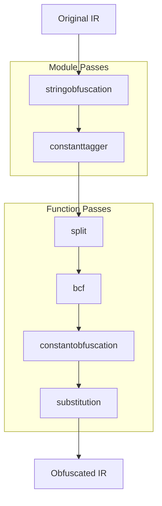

# AmazeLLVM Obfuscator

An LLVM 15-based compiler plugin that applies multiple obfuscation transformations to C/C++ programs at the IR (Intermediate Representation) level, making reverse engineering significantly harder while preserving program correctness.

## Contributions

- **Modern, Out-of-tree Obfuscation Framework**: Implements a modern LLVM 15 obfuscation framework based on the New Pass Manager and an out-of-tree plugin architecture.
- **Precise Metadata Coordination**: Introduces metadata-driven pass coordination through custom LLVM metadata (`!amaze.target.constant` and `!amaze.obfuscated`), enabling independent passes to cooperate without tight coupling.
- **Multi-Layer Obfuscation Pipeline**: Integrates five protection mechanisms—including String Obfuscation, Basic Block Splitting, Bogus Control Flow, and MBA-based Constant/Instruction Substitution—within a unified compilation pipeline.
- **Empirical Evaluation**: Provides exploratory evaluation against reverse-engineering workflows, including decompiler analysis, symbolic execution (angr), and SMT solving (Z3).
- **Real-world Applicability**: Demonstrates applicability on real-world software projects such as SQLite through automated correctness testing.

## Threat Model

AmazeLLVM is intended to increase the cost of analysis for:

- Static reverse engineering tools (IDA Free, Ghidra, Binary Ninja)
- Automated symbolic execution frameworks (angr, KLEE, Triton)
- Analysts relying primarily on automated decompilation and constraint solving.

The project does not aim to provide cryptographic security, tamper-proof protection, or resistance against a determined expert with unrestricted dynamic analysis capabilities.

---

## Features

| Pass | Flag | Description |
|------|------|-------------|
| String Obfuscation | `-obf-string` | Encrypts string literals; decrypts at runtime via XTEA |
| Constant Obfuscation | `-obf-const` | Replaces integer constants with MBA (Mixed Boolean-Arithmetic) expressions |
| Instruction Substitution | `-obf-sub` | Replaces standard arithmetic/bitwise ops with equivalent but complex expressions |
| Basic Block Splitting | `-obf-split` | Fragments basic blocks into smaller chunks to obscure control flow |
| Bogus Control Flow (BCF) | `-obf-bcf` | Inserts opaque predicates and fake branches that never execute |
| Enable All | `-obf-all` | Activates all passes in the correct pipeline order |

---

## Prerequisites

| Tool | Version | Purpose |
|------|---------|---------|
| LLVM / Clang | 15 | Compiler infrastructure and IR toolchain |
| `opt-15` | 15 | LLVM optimizer — loads the plugin and runs passes |
| `lli-15` | 15 | LLVM JIT executor for testing `.ll` files |
| CMake | ≥ 3.13 | Build system |
| Python 3 (Testing) | ≥ 3.8 | Run real-world test automation scripts |
| `bc` (Optional) | any | Used by `run.sh stats` for ratio calculation |

Install LLVM 15 on Ubuntu/Debian:
```bash
sudo apt install llvm-15 clang-15 lld-15
```

---

## Build

```bash
# First-time setup
mkdir build && cd build
cmake -DLLVM_DIR=/usr/lib/llvm-15/cmake ..
cd ..

# Compile the plugin
cd build && make -j$(nproc) && cd ..
```

The compiled plugin will be at `build/libObfPass.so`.

Or use the helper script:
```bash
./run.sh build
```

---

## Quick Start

### Using `run.sh` (Recommended)

```bash
./run.sh run    # Build and produce obfuscated output.ll
./run.sh exec   # Build, obfuscate, and run the result
./run.sh elf    # Build obfuscated + baseline ELF binaries and execute both
./run.sh diff   # Show IR-level instruction diff (original vs obfuscated)
./run.sh stats  # Print instruction count and binary size bloat ratios
./run.sh clean  # Delete the build directory
./run.sh reset  # Clean rebuild from scratch
./run.sh help   # Show all commands
```

The target source file is `test/input.c`. Outputs land in `test/`.

### Manual Pipeline

```bash
# 1. Compile C source to LLVM IR
clang-15 -S -emit-llvm -O1 test/input.c -o test/input.ll

# 2. Run all obfuscation passes (O3 pipeline)
opt-15 -load-pass-plugin=build/libObfPass.so -O3 -obf-all -S test/input.ll -o test/output.ll

# 3. Compile obfuscated IR to a native binary
clang-15 test/output.ll -o test/bin/output_bin

# 4. Run it
./test/bin/output_bin
```

### Selective Passes

Run only specific passes by naming them individually:

```bash
# String obfuscation only
opt-15 -load-pass-plugin=build/libObfPass.so -O3 -obf-string -S test/input.ll -o test/output.ll

# Specific pass combination
opt-15 -load-pass-plugin=build/libObfPass.so -O3 -obf-split -obf-bcf -S test/input.ll -o test/output.ll

# Manual pipeline string (fine-grained control)
opt-15 -load-pass-plugin=build/libObfPass.so \
    -passes="stringobfuscation,constanttagger,function(split,bcf,constantobfuscation,substitution)" \
    -S test/input.ll -o test/output.ll
```

---

## Command Line Parameters

AmazeLLVM provides fine-grained control over which passes are executed and how intensely they obfuscate the code:

| Parameter | Default | Description |
|-----------|---------|-------------|
| `-obf-all` | `false` | Enable all obfuscation passes in the correct pipeline order |
| `-obf-string` | `false` | Enable String Obfuscation |
| `-str-magic-symbol` | `""` | Target symbol name for STROBF-ENVBINDING |
| `-str-magic-value` | `""` | Expected runtime value for STROBF-ENVBINDING |
| `-obf-tag` | `false` | Enable Constant Tagging (`constanttagger`) |
| `-obf-const` | `false` | Enable MBA Constant Obfuscation (automatically enables `ConstTagger`) |
| `-obf-split` | `false` | Enable Basic Block Splitting |
| `-obf-bcf` | `false` | Enable Bogus Control Flow |
| `-obf-sub` | `false` | Enable Instruction Substitution |
| `-const-threshold` | `3` | Minimum frequency threshold for a constant to be tagged by `ConstTagger` |
| `-const-chance` | `100` | Probability (0-100) of applying MBA constant obfuscation |
| `-const-round` | `1` | Number of iterations/rounds for constant obfuscation |
| `-const-intensity`| `100` | Complexity of MBA constant obfuscation (0=simplest, 100=most complex) |
| `-sub-chance` | `100` | Probability (0-100) of substituting an arithmetic instruction |
| `-sub-round` | `1` | Number of iterations/rounds for instruction substitution |
| `-sub-intensity`| `100` | Complexity of MBA instruction substitution |

---

## Architecture

AmazeLLVM integrates into the LLVM 15 New Pass Manager, executing module-level analyses first, followed by function-level restructuring and algebraic substitution.

**Core Defense Mechanisms:**
* **String Obfuscation**: Encrypts global strings with XTEA at compile-time and injects a runtime decryptor.
* **Control Flow Manipulation**: Splits basic blocks and inserts opaque predicates to generate bogus control flow and dead branches.
* **MBA Substitution**: Identifies high-frequency constants and algebraic operations, replacing them with mathematically equivalent but complex Mixed Boolean-Arithmetic (MBA) formulas.



---

## Current Prototype Benchmark

Typical performance benchmark results measured on the AES-CBC cryptography library (using `tiny-AES-c` against a 1MB file):

| Pass Combination | Execution Time (Mean) | Overhead vs Baseline | Binary Size Bloat |
|------------------|-----------------------|----------------------|-------------------|
| **Baseline (O3)**| 20.6 ms | 0.46× | 1.00× |
| **None (Baseline)**| 45.0 ms | 1.00× | 1.00× |
| **split + bcf (+O3)**| 54.6 ms | 1.21× | 1.30× |
| **const + sub (+O3)**| 887.3 ms | 19.72× | 5.24× |
| **Full Obfuscation (+O3)** | 1158.9 ms | 25.75× | 7.18× |

*(Note: Heavy MBA equations scale exponentially with binary logic. For large-scale projects like SQLite, we recommend using `-const-threshold` to filter out non-critical constants and manage overhead).*

---

## Example Transformations

The following examples illustrate how AmazeLLVM transforms simple code into complex, obfuscated Intermediate Representation (IR).

### 1. String Obfuscation
Encrypts plaintext strings and injects a runtime decryption stub.

**Original LLVM IR:**
```llvm
@.str = private unnamed_addr constant [18 x i8] c"Important Secret!\00", align 1
```

**Obfuscated (`-obf-string`):**
```llvm
; 1. String is padded and XTEA-encrypted at compile time
@.str.obf = private unnamed_addr constant [16 x i8] c"\A3\F1\92\4B... (encrypted bytes)", align 1

define i32 @main() {
entry:
  ; 2. Lazy Decryption Block inserted at function entry
  ; Reads platform magic value (EnvBinding) to derive the runtime decryption key
  %env_magic = load i64, ptr @__mh_execute_header
  %derived_key = xor i64 %env_magic, 1311768467463790320
  
  ; 3. Calls the shared out-of-line decryption stub
  call void @__amaze_xtea_decrypt_stub(ptr @.str.obf, i64 %derived_key, ptr %stack_buf)
  
  ; 4. Original logic proceeds using the decrypted stack buffer
  call void @puts(ptr %stack_buf)

  ; 5. Volatile memory scrub prevents plaintext leakage before return
  call void @llvm.memset.p0.i64(ptr %stack_buf, i8 0, i64 16, i1 true)
  ret i32 0
}
```

### 2. Control Flow Manipulation
Injects opaque predicates and splits basic blocks to create a deceptive CFG.

**Original CFG:**
```text
[Block A] ---> [Block B]
```

**Obfuscated (`-obf-bcf`):**
```llvm
; Injects an opaque predicate: x^2 >= 0 (Always True)
%seed = load volatile i32, ptr @AmazeLLVM_OpaqueSeed
%squared = mul i32 %seed, %seed
%cmp = icmp sge i32 %squared, 0
br i1 %cmp, label %actual_block, label %junk_block

junk_block:
  ; Dead code path filled with randomized junk instructions
  ; ...
  br label %actual_block
```

### 3. Mixed Boolean-Arithmetic (MBA) Substitution
Transforms standard arithmetic and constants into complex mathematical equivalents.

**Original LLVM IR:**
```llvm
%add = add nsw i32 %x, 42
ret i32 %add
```

**Obfuscated (`-obf-const -obf-sub`):**
```llvm
; The constant 42 and the 'add' operation are expanded into an MBA expression:
%1 = xor i32 %x, %dummy_y
%2 = or i32 %x, %dummy_y
%3 = shl i32 %2, 1
%4 = sub i32 %3, %dummy_y
%5 = sub i32 %4, %x
; ... (further transformations)
```

---

## Documentation

For deep-dives into the design, benchmarking, and reverse engineering analysis of AmazeLLVM, check out the following documents:

* [Architecture](docs/architecture.md) — Detailed pipeline registration and execution order.
* [Performance Evaluation](docs/performance_evaluation.md) — Performance tracking record template.
* [Reverse Engineering Resistance Evaluation](docs/resistance_evaluation.md) — Analysis of obfuscation resistance against IDA Free, angr and z3.

---

## Real-World Tests

Automated correctness tests against real open-source projects:

```bash
# Test against tiny-AES-c (clones repo automatically)
python3 real_world_tests/test_tiny_aes.py

# Test against SQLite 3 (downloads amalgamation automatically)
python3 real_world_tests/test_sqlite.py
```

These scripts try all flag combinations and verify that obfuscated binaries produce identical output to the baseline.

---

## Project Layout

```
amaze-llvm-obfuscator/
├── lib/
│   ├── PipelineRegistration.cpp   # Plugin entry point; registers all passes
│   ├── StringObfuscation.{h,cpp}  # String literal encryption
│   ├── ConstantObfuscation.{h,cpp}# MBA-based constant hiding
│   ├── Substitution.{h,cpp}       # Arithmetic instruction substitution
│   ├── SplitBasicBlocks.{h,cpp}   # Basic block fragmentation
│   ├── BogusControlFlow.{h,cpp}   # Opaque predicate insertion
│   └── Utils/                     # MBA engine, solver, constant analysis
├── test/
│   ├── input.c                    # Default test target
│   ├── input.ll / output.ll       # Generated IR files
│   └── bin/                       # Compiled binaries
├── real_world_tests/              # Automated integration tests
├── build/                         # CMake build artifacts (gitignored)
├── CMakeLists.txt
└── run.sh                         # Developer convenience script
```

---

## Future Work

- [ ] Cross-Platform Validation
- [ ] ConstantTagger Algorithm Optimization
- [ ] MBA Diversity Expansion
- [ ] Fine-Grained Selective Obfuscation API
- [ ] Pass Pipeline Optimization
- [ ] Advanced Obfuscation Mechanisms
- [ ] Dynamic Analysis Hardening
- [ ] Evaluation of LLM-Assisted Reverse Engineering Workflows
---

## Contributors

| Contributor | Core Contributions | Key Modules & Areas |
| :--- | :--- | :--- |
| [**@cwyong97**](https://github.com/cwyong97) | Infrastructure &<br>Control Flow Obfuscation | <ul><li>LLVM 15 Pass Manager framework</li><li>CMake infrastructure</li><li>[`SplitBasicBlocks`](lib/SplitBasicBlocks.cpp)</li><li>[`BogusControlFlow`](lib/BogusControlFlow.cpp)</li></ul> |
| [**@NOOTNOOTPINGUUU**](https://github.com/NOOTNOOTPINGUUU) | Data Flow Obfuscation &<br>Evaluation | <ul><li>[`MBA generation framework`](lib/Utils/MBAEngine.h)</li><li>[`ConstantObfuscation`](lib/ConstantObfuscation.cpp)</li><li>[`InstructionSubstitution`](lib/Substitution.cpp)</li><li>[`StringObfuscation`](lib/StringObfuscation.cpp)</li><li>[`Environment Binding`](lib/Utils/EnvBinding.h)</li><li>[Evaluation](real_world_tests/) (`angr`, `Z3`)</li></ul> |

<br>

> **Note:** Both contributors participated in pipeline design, integration testing, debugging, and project documentation.

---


## Acknowledgments

- **[LLVM Project](https://llvm.org/)** — The entire infrastructure this project is built on. LLVM 15's New Pass Manager API drives the plugin system.
- **[obfuscator-llvm / Hikari](https://github.com/HikariObfuscator/Hikari)** — Pioneering open-source LLVM obfuscator; the `BCF` and `stringobfuscation` concepts (especially the lazy decryption block-splitting architecture) here are inspired by its design.
- **[tiny-AES-c by kokke](https://github.com/kokke/tiny-AES-c)** — Lightweight AES implementation used as a real-world obfuscation correctness test.
- **[SQLite](https://www.sqlite.org/)** — The SQLite amalgamation (3.41.2) is used as a stress test for large-scale IR obfuscation.
- **[Justus Polzin (plzin)](https://plzin.github.io/posts/mba)** — The primary technical and theoretical foundation for our Mixed Boolean-Arithmetic (MBA) implementation. His work directly inspired the 16-base linear solver for instruction/constant obfuscation.
