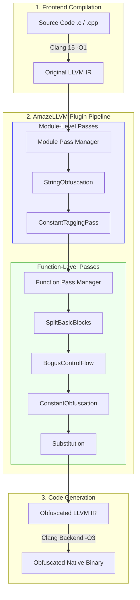

# AmazeLLVM Architecture & Core Defense Mechanisms

This document provides a detailed overview of the compilation pipeline, pass architecture, and the core algorithmic design of each defense mechanism within the **AmazeLLVM Obfuscator**.

---

## 1. System Architecture & Pipeline

### 1.1 Module Structure
AmazeLLVM is delivered as a single dynamic plugin library (`libObfPass.so`). It contains seven core modules split across the `ModulePass` and `FunctionPass` levels:

| Module File | Pass Name | Level | Functionality |
|---|---|---|---|
| `PipelineRegistration.cpp` | (Entry) | — | Registers all passes and parses command-line flags. |
| `StringObfuscation.cpp` | `stringobfuscation` | `ModulePass` | Global string XTEA encryption. |
| `ConstantAnalyzer.cpp` | `constanttagger` | `ModulePass` | Constant frequency analysis + Metadata tagging. |
| `SplitBasicBlocks.cpp` | `split` | `FunctionPass` | Random basic block splitting. |
| `BogusControlFlow.cpp` | `bcf` | `FunctionPass` | Fake control flow + Opaque predicates. |
| `ConstantObfuscation.cpp` | `constantobfuscation` | `FunctionPass` | MBA constant obfuscation (depends on ConstTagger). |
| `Substitution.cpp` | `substitution` | `FunctionPass` | MBA instruction substitution (`Add`/`Sub`/`And`/`Or`/`Xor`). |

### 1.2 Pipeline Execution Order
When using `-obf-all`, the six passes execute in a fixed sequence determined by their strict data dependencies. The obfuscator integrates directly into LLVM 15's **New Pass Manager** (NPM) via the `OptimizerLastEPCallback` extension point.



### 1.2 Pipeline Execution Logic

The strict ordering of the pipeline passes (`StringObf` → `Split` → `BCF` → `ConstObf` → `Substitution`) is deliberately designed to handle cross-pass dependencies and prevent plaintext leakage:

1. **`StringObf` and `BCF` Recommended Before `ConstObf`**: `StringObfuscation` and `BogusControlFlow` both inject new, sensitive constants (e.g., XTEA keys, opaque predicate seeds) and tag them with `!amaze.target.constant`. By scheduling them earlier in the pipeline, `ConstantObfuscation` can catch and expand these newly injected constants, providing deeper protection.
2. **`ConstObf` Recommended Before `Substitution`**: If `Substitution` ran before `ConstantObfuscation`, a simple expression like `A + B` (where A and B are plaintext constants) would be expanded into a massive substitution formula containing many exposed instances of `A` and `B`. By running `ConstantObfuscation` first, the constants are already converted into complex MBA variables before the instruction itself is substituted.
3. **`ConstantTaggingPass` Dependency (Strict Requirement)**: `ConstTagger` (producer) **MUST** execute before `ConstantObfuscation` (consumer). Without `ConstantTaggingPass` tagging instructions with `!amaze.target.constant`, `ConstantObfuscation` will not obfuscate anything.

### 1.3 Custom Metadata for Cross-Pass Communication
AmazeLLVM utilizes custom LLVM Metadata attached to `Instruction`s as cross-pass visible markers, avoiding global state and decoupling the passes:

| Metadata Name | Producer | Consumer | Purpose |
|---|---|---|---|
| `!amaze.target.constant` | `ConstTagger`, `StringObfuscation`, `BogusControlFlow` | `ConstantObfuscation` | Marks constants that should be converted to MBA expressions. |
| `!amaze.obfuscated` | `MBABuilder` (Shared utility) | `Substitution` | Marks instructions newly generated by MBA to prevent infinite recursive substitution. |

### 1.4 MBA Shared Infrastructure
`ConstantObfuscation` and `Substitution` share the identical MBA engine composed of four components:
* **`MBAEngine`** (Facade): Orchestrates matrix construction, solving, and IR generation. Shuffles the 16 standard bases randomly on every obfuscation to achieve structural polymorphism, countering pattern-matching attacks.
* **`MBASolver`**: A Smith Normal Form solver that solves $A \cdot x \equiv b \pmod{2^{64}}$. *(Linear solver approach inspired by Justus Polzin)*
* **`MBABuilder`**: An IR builder that translates the solved vector back into LLVM IR instruction trees and tags them with `!amaze.obfuscated`.
* **`MBABasis`**: A pool of 16 standard 2-variable Boolean function bases.

---

## 2. String Obfuscation (`StringObfuscation`)

Strings are the most direct source of information in reverse engineering. Attackers typically use the `strings` command to locate sensitive information such as error messages, API endpoints, or license keywords. This pass protects strings by encrypting them at compile-time using XTEA and dynamically decrypting them at runtime.

### 2.1 Core Algorithm: XTEA + Environment Binding Key

**Compile-time Encryption:**
1. Pad strings to 8-byte alignment, calculating `chunkCount = ceil(len / 8)`.
2. Retrieve a platform-specific magic value `M` (e.g., `0xFEEDFACF` for Mach-O) from the `EnvBinding`.
3. Generate a random 64-bit base key `K` and derive a 128-bit XTEA key:
   `k[0] = low32(K), k[1] = high32(K), k[2] = k[0] ⊕ 0x3F4B5C6D, k[3] = k[1] ⊕ 0x7E8D9C0A`
4. Execute 32 rounds of XTEA encryption on each 8-byte chunk to produce a ciphertext array.

**Runtime Decryption (IR Generation):**
1. Load the magic value `M'` from the runtime environment.
2. Calculate the decryption key: `DecryptionKey = M' ⊕ (K ⊕ M)`. (If `M' == M`, the correct key `K` is recovered).
3. Derive the 128-bit XTEA key and call a shared `__amaze_xtea_decrypt_stub()` to decrypt.
4. Write the plaintext to a stack-allocated buffer, and wipe it with a `volatile memset(0)` before the function returns.

*This environment binding ensures that the program only decrypts correctly on the target platform. Executing the binary in a mismatched environment (like a sandbox or VM) yields incorrect keys and garbage strings.*

### 2.2 Key Implementation Decisions

| Decision | Description |
|---|---|
| **XTEA Stub Out-lining (`noinline`)** | Fully unrolling 32 rounds of XTEA in IR creates ~320 instructions per string. Using a shared `__amaze_xtea_decrypt_stub` significantly reduces code bloat. |
| **Lazy Decryption Architecture** | The Entry Block is split: BlockA → BlockB (Decryption) → BlockC (Original logic). Strings are only decrypted when the function is actually called. *(Inspired by Hikari Obfuscator)* |
| **Stack Buffer + Volatile Scrub** | Decrypted strings are stored on the stack (not heap). Before function return, the buffer is wiped with `volatile memset(0)` to prevent memory forensics. |
| **Metadata Tagging for Keys** | Key derivation instructions (`K0`–`K3`) are tagged with `!amaze.target.constant` to be heavily obfuscated by the `ConstantObfuscation` MBA pass. |
| **Escape Analysis Filtering** | If a string pointer escapes the function (e.g., returned or stored to a non-stack location), obfuscation is skipped to prevent Use-After-Free vulnerabilities. |
| **Wrapper GV Recursive Processing** | Supports strings embedded in structs or arrays (e.g., `{i8*, i32}`). Recursively processes and initializes wrapper fields. |

### 2.3 `STROBF-ENVBINDING`: Implicit Environment Binding
The XTEA decryption key is dynamically bound to a target runtime value. This acts as an implicit authentication mechanism: there is no explicit key comparison instruction (e.g., `cmp`, `test`) in the generated code. If the runtime value matches the expected compile-time value, the string decrypts correctly; otherwise, it yields unreadable data.

**Automated OS-Level Binding (Default)**
By default, `EnvBinding` automatically targets OS-specific linker symbols to prevent cross-environment analysis or execution:
* **Windows**: Binds to `__ImageBase` (Expected PE Magic `0x5A4D` / `MZ`).
* **Linux**: Binds to `__ehdr_start` (Expected ELF Magic `0x464C457F` / `\x7FELF`).
* **macOS**: Binds to `__mh_execute_header` (Expected Mach-O Magic `0xFEEDFACF`).

**Custom Binding (Licensing & Fallbacks)**
The user can override the automated binding at compile time using command-line flags. This serves as a fallback for unsupported systems or can be utilized as a licensing mechanism where the string is only decrypted when a specific user-defined key is present in the runtime environment.

**Example: Binding to a custom license key**
```bash
# 1. Compile source to LLVM IR
clang-15 -S -emit-llvm -O1 test_license.c -o test_license.ll

# 2. Obfuscate strings and bind decryption to a custom symbol and value
opt-15 -load-pass-plugin=build/libObfPass.so -O3 -obf-string \
    -str-magic-symbol "my_license_key" -str-magic-value "1234567890" \
    -S test_license.ll -o test_license.ll

# 3. Compile to binary
clang-15 -O3 -g -o test_license_bin test_license.ll

# 4. Execute (requires the correct 'my_license_key' value at runtime)
./test_license_bin
```

### 2.4 Obfuscation Effect Comparison

| Metric | Before Obfuscation | After Obfuscation |
|---|---|---|
| **`strings` output** | Plaintext strings clearly visible | Only encrypted hex data, no readable strings |
| **IDA Decompilation** | `strcpy(..., "secret")` | Call to `amaze_xtea_decrypt_stub` with random constant arrays |
| **Code Lines** | ~18 lines, clear logic | ~48 lines, heavily mixed with decryption constants and array ops |
| **Readability** | High (Directly visible) | Low (Requires reversing XTEA logic) |

---

## 3. Control Flow Manipulation

Control flow manipulation artificially increases the complexity of basic blocks, filling decompiler pseudocode with nested loops and dead paths to increase cognitive load.

### 3.1 `SplitBasicBlocks`
Breaks linear basic blocks into multiple smaller ones. While it doesn't change program semantics, it significantly increases the number of Control Flow Graph (CFG) nodes and creates insertion points for Bogus Control Flow.
* Snapshots all `BasicBlock` pointers to prevent iterator invalidation during splitting.
* Selects split points randomly in the range `[1, size-2]`, avoiding the first (often `PHI`) and last (`Terminator`) instructions.
* Protects `PHINode`, `EHPad`, and `Terminator` instructions to maintain SSA and Exception Handling semantics.
* Blocks can be split sequentially up to a maximum limit (e.g., `MAX_SPLITS = 3`).

### 3.2 `BogusControlFlow`
Inserts opaque predicates and junk code blocks to construct a highly complex, deceptive CFG.
* **Opaque Predicate Design ($x^2 \ge 0$)**:
  1. Creates a global seed variable `AmazeLLVM_OpaqueSeed` (non-const, internal linkage).
  2. Performs a `volatile store` of a random value—strictly constrained to the range `[1, 1000]` to prevent integer overflow from breaking the mathematical invariant—into the seed, and tags it with `!amaze.target.constant`. This also breaks IDA's dead-store analysis.
  3. Performs a `volatile load` (preventing constant folding) and calculates `squared = seedLoad * seedLoad`.
  4. Generates an `icmp sge squared, 0` check. For any signed integer $x$, $x^2 \ge 0$ is a mathematical certainty (always true).
  5. Replaces unconditional jumps with this condition. True branches to the actual code; False branches to the junk/dead path.
* *Note: Using $x^2 \ge 0$ instead of $x == 0$ guarantees the predicate is always true even after writing a random value, preserving correct program semantics.*

---

## 4. Instruction Substitution & Constant Obfuscation

### 4.1 `ConstantTaggingPass` (ConstTagger)
ConstTagger identifies semantically important constants (e.g., magic numbers, protocol codes) by their frequency. It uses a threshold mechanism to apply Heavy MBA obfuscation efficiently without destroying performance.

**Algorithm Phases:**
1. **Analyze Constants**: Scans the module to build a frequency map of `(value, type)` for all `ConstantInt` operands.
2. **Tag Operands**: Constants with frequency $\ge$ Threshold (default: 3) receive the `!amaze.target.constant` metadata.

**Filtering Rules (`isTaggingAllowed`):**

| Excluded Instruction/Condition | Rationale for Exclusion |
|---|---|
| `GetElementPtrInst` (GEP) | Modifying index constants destroys memory addressing semantics. |
| `PHINode` | Constants in PHI nodes participate in SSA merging and cannot be dynamically replaced. |
| `AllocaInst` | Allocation sizes determine the stack frame layout. |
| `SwitchInst` | Switch `case` values must remain compile-time constants. |
| `CallInst` (Intrinsic) | LLVM intrinsics have strict ABI constraints (e.g., `llvm.memcpy` alignment). |
| $\|value\| \le 10$ | Small constants are highly likely to be folded back by `-O3` passes, yielding low ROI. |

### 4.2 `ConstantObfuscation` (MBA)
Replaces tagged constants with equivalent Mixed Boolean-Arithmetic (MBA) formulas. The goal is to construct a function $f(x, y) = C$ whose truth table is `[C, C, C, C]`. The `MBAEngine` solves for coefficients $a[j]$ such that $\Sigma a[j] \cdot basis[j](x, y) = C$.

To provide dummy variables $x$ and $y$, the pass utilizes the first two integer arguments of the function (secured via volatile memory operations to maintain opacity) or falls back to `llvm.frameaddress`.

### 4.3 `Substitution`
Performs structural replacement of standard arithmetic and logical operations (`add`, `sub`, `and`, `or`, `xor`). Targets are defined via truth tables and solved by the `MBAEngine`:

| Original Instruction | f(0,0) | f(0,1) | f(1,0) | f(1,1) | Truth Table |
|---|---|---|---|---|---|
| `x + y` | 0 | 1 | 1 | 2 | `[0, 1, 1, 2]` |
| `x - y` | 0 | -1 | 1 | 0 | `[0, -1, 1, 0]` |
| `x & y` | 0 | 0 | 0 | 1 | `[0, 0, 0, 1]` |
| `x \| y` | 0 | 1 | 1 | 1 | `[0, 1, 1, 1]` |
| `x ^ y` | 0 | 1 | 1 | 0 | `[0, 1, 1, 0]` |

To prevent exponential code bloat from recursively obfuscating previously generated MBA instructions, newly created IR instructions are tagged with `!amaze.obfuscated` metadata, instructing the `Substitution` pass to skip them.
