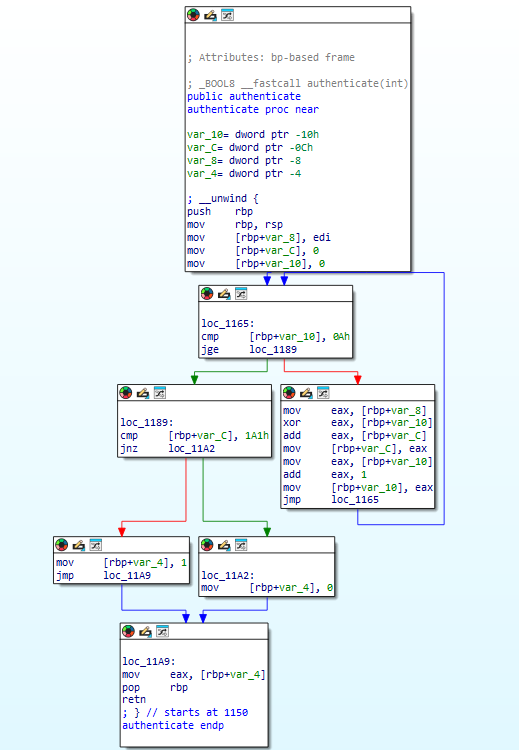
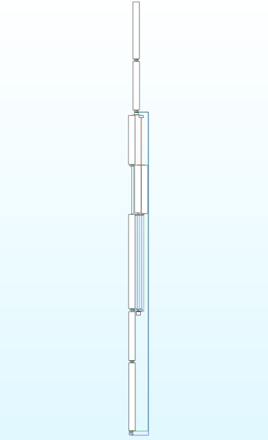

# Reverse Engineering Resistance Evaluation

This document evaluates the effectiveness of the AmazeLLVM obfuscator against standard reverse engineering and automated analysis tools, focusing on SMT Solver hardening.

## Experimental Setup

- **Compiler**: LLVM 15
- **OS**: Ubuntu 24.04
- **CPU**: Intel i5-12600K

## 1. Decompiler Evaluation (IDA Free)
Decompilers translate compiled binary machine code back into high-level C-like pseudocode, relying heavily on value-range propagation, expression folding, and control flow structuring. 

AmazeLLVM is designed to disrupt these assumptions at multiple levels:
- **Control Flow Flattening & Bogus Control Flow**: The original linear logic is trapped within opaque predicates and nested loops. The resulting pseudocode becomes substantially more
difficult to interpret manually.
- **Constant & String Masking**: Plaintext strings and targeted constants are completely removed from the `.rodata` section and binary layout, replaced by dynamic runtime decryption stubs and Mixed Boolean-Arithmetic (MBA) formulas.

### 1.1 Before/After Comparison

To evaluate the obfuscator, we use a simple validation program (`evaluation_demo.c`) that authenticates an input via a 10-iteration loop. The following comparison demonstrates the impact of AmazeLLVM on the IDA Free decompilation output of the `authenticate` function.

#### Original Binary (Clean Logic)
*(Original clean CFG and pseudocode of `authenticate`)*


```c
// Example of Original IDA Free Output from evaluation_demo.c
_BOOL8 __fastcall authenticate(int a1)
{
  int i; // [rsp+0h] [rbp-10h]
  int v3; // [rsp+4h] [rbp-Ch]

  v3 = 0;
  for ( i = 0; i < 10; ++i )
    v3 += i ^ a1;
  return v3 == 417;
}
```

#### Obfuscated Binary (CFG Bloat & MBA Expansion)
*(Obfuscated CFG and MBA expressions)*


```c
// Example of Obfuscated IDA Free Output from evaluation_demo.c (Snippet)
// Notice how standard loops are broken and arithmetic is expanded into MBA
__int64 __fastcall authenticate(int a1)
{
  int v2; // [rsp+4h] [rbp-28h]
  signed int v3; // [rsp+18h] [rbp-14h]
  int v4; // [rsp+1Ch] [rbp-10h]
  unsigned int v5; // [rsp+24h] [rbp-8h]

  v4 = 0;
  AmazeLLVM_OpaqueSeed = 2069521674 * ~a1 + 731368867 * ~a1 /* ... [MBA Expansion Omitted] ... */;
  v3 = 0;
  AmazeLLVM_OpaqueSeed_1 = 1890276667 * (a1 | ~a1) /* ... [MBA Expansion Omitted] ... */;
  
  while ( v3 < 10 )
  {
    AmazeLLVM_OpaqueSeed_2 = 215150476 * ~a1 + -356608269 * (a1 & ~a1) /* ... [MBA Expansion Omitted] ... */;
    v2 = 639470117 * v3 + -1932753271 * (v3 & a1) /* ... [MBA Expansion Omitted] ... */;
    v4 = 1699143892 * (v2 | ~v4) + 146028164 * ~v2 /* ... [MBA Expansion Omitted] ... */;
    
    // ... [Hundreds of lines of Bogus Control Flow blocks omitted] ...
    
    v3 = 435544467 * (v3 | 1) + -200238003 * (~v3 | 1) /* ... [MBA Expansion Omitted] ... */;
  }

  // Note: Constant 417 is retained here because it is a single-use constant 
  // and did not reach the threshold for automatic Constant Obfuscation. 
  // It can be masked using explicit `!amaze.target.constant` metadata if desired.
  if ( v4 == 417 )
  {
    v5 = 1;
    AmazeLLVM_OpaqueSeed_6 = -2006554452 * ~a1 /* ... [MBA Expansion Omitted] ... */;
  }
  else
  {
    v5 = 0;
    AmazeLLVM_OpaqueSeed_7 = -2014938704 * ~a1 /* ... [MBA Expansion Omitted] ... */;
  }
  return v5;
}
```

## 2. Symbolic Execution Evaluation (angr)

To evaluate dynamic symbolic execution, we developed a standard benchmark (`angr_test.py`) targeting the validation function from `evaluation_demo.c`. 

### 2.1 The Impact of Compiler Optimization Pipelines
During our evaluation, we discovered that the behavior of `angr` against AmazeLLVM is heavily dependent on the LLVM optimization pipeline (specifically `SimplifyCFG` in `-O3` vs `-O0`):

#### Scenario A: Optimized Build (`-O3`)
When the binary is compiled with standard `-O3` optimizations, LLVM's `SimplifyCFG` pass aggressively collapses the `if-else` branches (including AmazeLLVM's opaque predicates) into branchless conditional moves (`cmove`).
- **Observation**: Because there are no physical branches, `angr` does not fork its execution state (`Active States = 1`). However, the conditional logic is propagated into memory pointers, creating a symbolic pointer constraint.
- **Analysis Impact**: When `angr` reaches standard library calls like `puts` with a symbolic string pointer, the underlying solver (Z3) is forced to evaluate the entire chain of Mixed Boolean-Arithmetic (MBA) equations to determine the concrete memory addresses. In our experiment,
constraint evaluation associated with symbolic pointers
introduced substantial solver overhead,
causing individual analysis steps
to exceed 60 seconds.

#### Scenario B: Unoptimized Build (`-O0`)
When compiled with `-O0` (disabling `SimplifyCFG`), all physical branches injected by Bogus Control Flow (BCF) are preserved.
- **Observation**: Because `angr` must evaluate the satisfiability of the branches, and we configured it to explicitly model uninitialized `volatile` seeds as symbolic variables (`SYMBOL_FILL_UNCONSTRAINED_MEMORY`), `angr` forks its state at every opaque predicate.
- **Analysis Impact**: The execution generates an exponentially growing number of state forks, exceeding 54,000 active states and exhausting the 6,000-second exploration timeout budget before reaching the core logic.
### 2.2 Empirical Test Results

| Binary Configuration | Time to Solve | Active States | Status |
| :--- | :--- | :--- | :--- |
| **Original (No Obfuscation)** | 0.34s | < 10 | Solved |
| **AmazeLLVM (-O3 Optimized)** | > 60.0s | 1 | Timeout (Constraint Solving) |
| **AmazeLLVM (-O0 Unoptimized)** | > 6000s | 54,258+ | Timeout (State Growth) |

*Note: In the `-O3` test, although the active state count remains at 1, the execution eventually reaches the failure path
and is moved into the Avoid stash
before a successful solution is recovered.*

## 3. SMT Solver Evaluation (Z3 Bottleneck)

To empirically verify the constraint-solving bottleneck observed in the `-O3` configuration, we isolated the MBA expansion logic and benchmarked the raw Z3 solver against equations of varying bit-widths:

| Expression Type | Z3 Solving Time (seconds) | Status / Result |
| :--- | :--- | :--- |
| **Baseline (Standard Math)** | ~0.01s | Solved instantly |
| **MBA Expansion (8-bit)** | 0.4s | Solved |
| **MBA Expansion (12-bit)** | 650.0s | Solved |
| **MBA Expansion (16-bit)** | > 57,600s | **Timeout (> 16 hours)** |
| **MBA Expansion (32/64-bit)** | Not solved within the experiment timeout budget. |_|

*Note: The above test results were derived from verifying the satisfiability/equivalence of the following generated 64-bit MBA formula against the original expression $x + y$. To reproduce these results or generate new formulas, please refer to the benchmark scripts in the `evaluation/` directory.*

$$
x + y \equiv \begin{aligned}
& \quad 6241896804268449296 \cdot (\neg x \lor y) \\
& - 1026612226039469256 \cdot (\neg x \land y) \\
& - 8425296955366212568 \cdot (\neg(x \oplus y)) \\
& + 2183400151097763272 \cdot (\neg x) \\
& - 1965550304792400698 \cdot x \\
& - 6899108888492644333 \cdot (x \land y) \\
& + 1965550304792400699 \cdot (x \land \neg y) \\
& - 7398684729326743311 \cdot y
\end{aligned}
$$

## 4. Conclusion

These results suggest that the combined effect of MBA substitution and control-flow obfuscation substantially increases the cost of symbolic exploration under the tested angr configuration. By leveraging both state growth (via unoptimized CFG expansion) and constraint hardness (via optimized symbolic pointers), AmazeLLVM forces analysis tools to confront significant computational barriers regardless of the underlying compiler pipeline.
